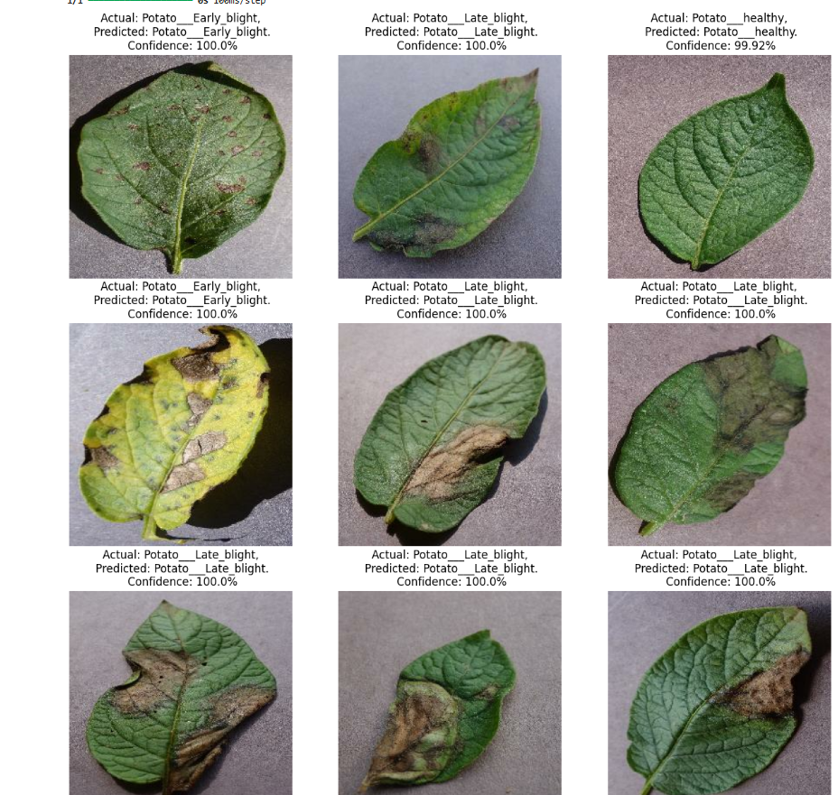

# 🥔 Potato Disease Classifier

A web application that uses deep learning to classify potato leaf diseases from images. Built with FastAPI, React, and TensorFlow.

---

## 🚀 Features

- Upload potato leaf images for instant disease prediction
- Three-class classification: Early Blight, Late Blight, Healthy
- Modern, responsive UI
- Real-time confidence scores
- Drag & drop image upload
- Clear/reset functionality

---

## 🛠️ Tech Stack

**Frontend:**  
- React  
- Material-UI  
- Axios  
- Create React App

**Backend:**  
- FastAPI  
- TensorFlow / Keras  
- NumPy  
- Pillow (PIL)

**Model:**  
- Custom-trained Keras model (`model/1.keras`, `2.keras`, `3.keras`)

---

## 📸 Screenshots

### Prediction Result


---

## 🏗️ Project Structure

```
Potato-Disease-Classifier/
├── API/
│ ├── app.py
│ ├── models.config
│ ├── requirements.txt
│ └── ...
├── frontend/
│ ├── src/
│ │ ├── App.js
│ │ ├── home.js
│ │ └── ...
│ ├── public/
│ │ └── index.html
│ ├── package.json
│ ├── README.md
│ └── screenshots/
│ ├── home.png
│ └── result.png
├── model/
│ ├── 1.keras
│ ├── 2.keras
│ └── 3.keras
├── training/
│ ├── training.ipynb
│ └── screenshots/
│ └── output.png
└── ...

```


---

## ⚡ Quick Start

### 1. Clone the repository

```sh
git clone https://github.com/zCODER0521/potato-disease-classifier.git
cd potato-disease-classifier
```

### 2. Backend Setup

cd API
pip install -r requirements.txt
uvicorn app:app --reload

